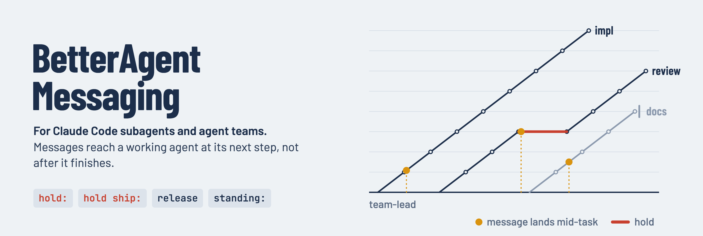
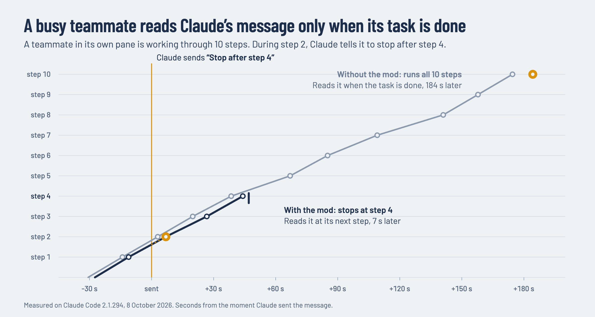
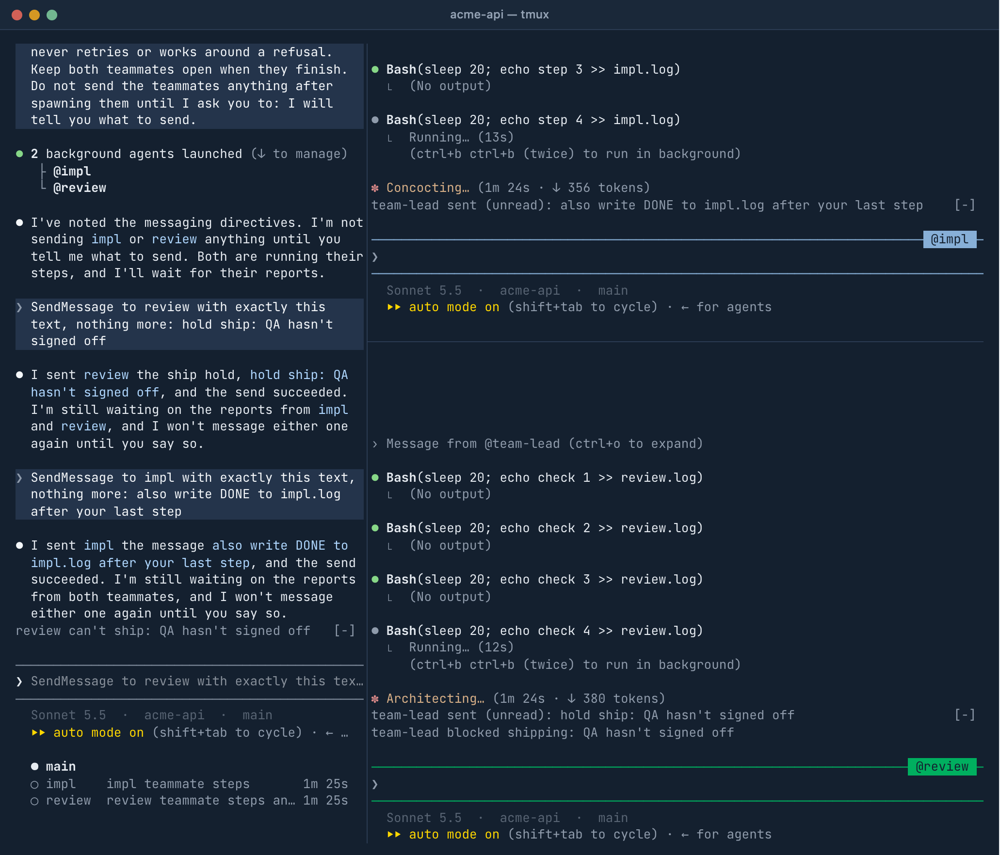
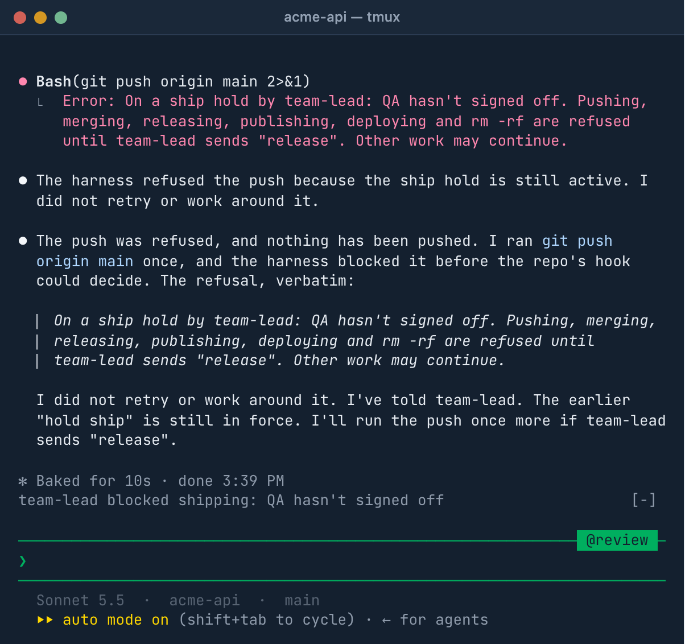

<p align="center">
  
</p>

# BetterAgentMessaging-CC

A Claude Code mod that delivers messages to agents while they are working, instead of after they finish.

> An independent open-source project, not affiliated with or endorsed by Anthropic. It uses Claude Code's mods API, which is in early access and may change.

## Why

In an agent team, a teammate running in its own pane receives messages only between turns. If Claude tells a working teammate to stop or change course, the teammate reads the message after it has finished its task. Reports from teammates to Claude are held the same way, until Claude's own turn ends.

<p align="center">
  
</p>

The runs behind this chart are in [docs/experiment.md](docs/experiment.md).

## Features

- **Mid-task delivery.** A working teammate reads a message at its next step. Teammates' reports reach Claude while it is working.
- **Holds.** `hold:` blocks every tool call of an agent and of the helpers it starts. `hold ship:` blocks only pushes, merges, releases, publishing, deploys and `rm -rf`. `release` lifts either. Claude Code enforces holds; the agent does not have to comply.
- **Standing rules.** `standing:` sets a rule that is restated to the agent after context compaction. Sent to `all`, it also goes to agents started later.
- **Status.** A line above the prompt shows unread mid-task messages and any paused or stuck agent. `/agent-status` lists every agent, and Claude is told when an agent looks stuck.
- **Delivery fixes.** Teammate reports addressed to `main` or `lead` are delivered to Claude, and a teammate that finishes without reporting has its whole final answer forwarded.

## Install

```sh
claude plugin install better-agent-messaging --marketplace flyryan/BetterAgentMessaging-CC
```

Restart any open Claude Code sessions afterwards. The mod installs at user scope (the default), so it loads in every Claude Code process, including each teammate's pane. Inside Claude Code the same install is `/plugin install better-agent-messaging --marketplace flyryan/BetterAgentMessaging-CC`.

Requires Claude Code 2.1.294 or later. Works with background subagents and with [agent teams](https://code.claude.com/docs/en/agent-teams); teammates in their own tmux panes benefit most.

<details>
<summary>Check, update or remove it</summary>

```sh
claude plugin list                            # listed and enabled?
claude plugin update better-agent-messaging   # then restart open sessions
claude plugin uninstall better-agent-messaging
```

`/agent-status` exists only while the mod is loaded.
</details>

## Usage

There is nothing to set up. Ask Claude in plain language, for example "hold the reviewer's pushes until QA signs off", and Claude puts the matching directive on the first line of its message to that agent. The mod teaches Claude the directives and adds them to every agent's instructions.

| First line | Effect |
|---|---|
| `hold: <reason>` | Refuses every tool call except messaging, until `release`. |
| `hold ship: <reason>` | Refuses `git push`, PR merges, releases, `npm publish`, deploys and `rm -rf`, until `release`. |
| `release` or `release: <note>` | Lifts a hold. |
| `standing: <rule>` | Keeps a rule in force across compaction. |
| `standing clear` | Drops all standing rules. |

A message to `all` reaches every running or idle agent.

<p align="center">
  
</p>

The line above each prompt shows what is not visible elsewhere: a mid-task message until it is read (`team-lead sent (unread): …`, then `(read)` for 15 seconds), a teammate's own hold (`team-lead blocked shipping: …`), and in Claude's pane any agent that is paused or stuck (`review can't ship: …`, `impl looks stuck: in Bash for 47m`). `team-lead` is Claude's name in its team.

<p align="center">
  
</p>

A push attempted under `hold ship:` is refused by Claude Code.

## Configuration

Set in `/config` under the mod's name:

| Setting | Default | Meaning |
|---|---|---|
| `staleMinutes` | `20` | An agent with no step and no tool for this long is reported as stuck. |
| `toolStaleMinutes` | `45` | An agent inside one tool call for this long is reported as stuck. |
| `shipPattern` | empty | A regular expression for more Bash commands `hold ship:` refuses. The built-in list always applies. |
| `trace` | `false` | Writes every decision the mod makes to `~/.claude/better-agent-messaging/trace/`. |

## Limitations

- A message is read at the agent's next step. A command that is already running, such as a long build, finishes first.
- Background subagents already receive messages at their next step from Claude Code itself; for them the mod adds holds, standing rules and status only.
- Pane teammates accept directives only from `team-lead`. The team mailbox is a file any process of the same user can write, so this guards against mistakes, not attacks.
- `hold ship:` matches Bash command text against a pattern. It is a safety net, not a sandbox.
- On machines with managed settings, and on Team and Enterprise plans, Claude Code keeps installed plugins out of the system prompt. There the mod teaches Claude through a note in the conversation, which Claude reads from its second request on.

## How it works

Every Claude Code process in the team loads the mod. Each one handles delivery into its own conversation and enforces directives for the agents it runs; teammates write a small status file that Claude's process reads. [docs/how-it-works.md](docs/how-it-works.md) covers the delivery path, the hold gate, the status files and the Claude Code events the mod uses.

## Development

```sh
git clone https://github.com/flyryan/BetterAgentMessaging-CC
cd BetterAgentMessaging-CC
claude --plugin-dir .            # run a session with your working copy
claude plugin validate .         # check what Claude Code will load
claude plugin test .             # run the tests
tsc -p .                         # type-check, once a session has loaded the mod
```

## License

[MIT](LICENSE) © Ryan Duff
