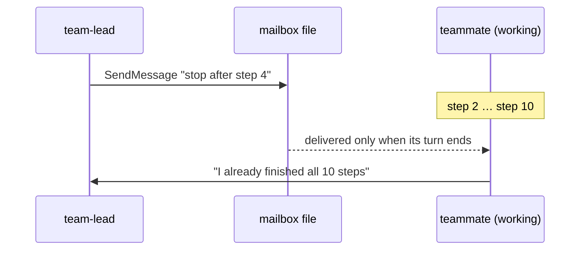
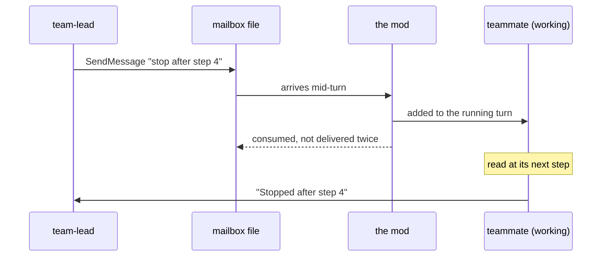
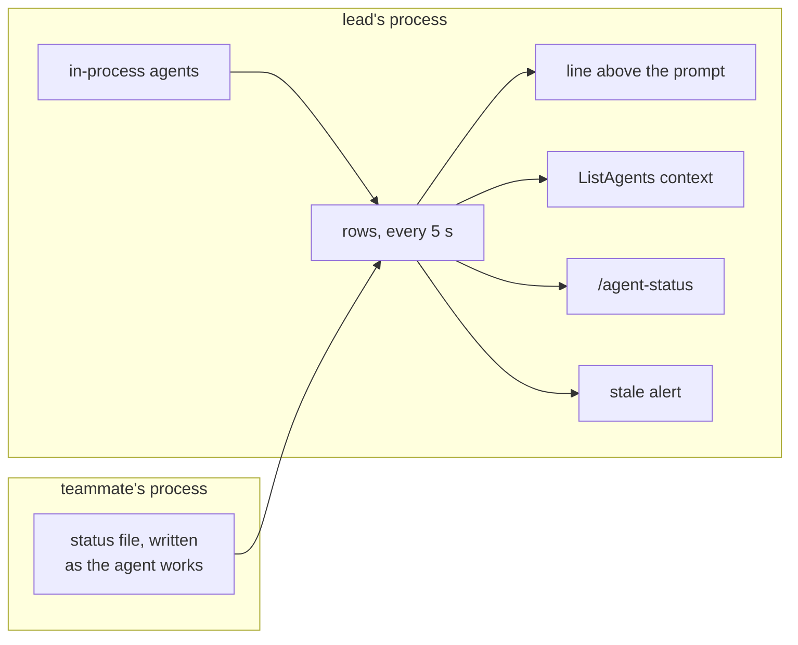

# How it works

BetterAgentMessaging-CC is a Claude Code **mod**: a TypeScript module of function hooks that runs inside the engine. This page covers where a message goes with and without the mod, how directives are enforced, how the lead learns what its agents are doing, and which engine events the mod hooks.

## Every process is a node

An agent team with tmux pane teammates is several separate `claude` processes. The lead is one process. Each pane teammate is another, started with `--agent-name <name> --team-name <team>`, and it receives messages through a mailbox file at `~/.claude/teams/<team>/inboxes/<name>.json`. The lead's process cannot reach into a teammate's conversation, so the mod has to run in every process. Each copy takes care of its own conversation.

At startup, each copy reads the flags of the `claude` process it runs in to learn its role: the lead, or a pane teammate with a name and a team. A process sometimes receives its first mailbox delivery before its startup hook has finished, so every hook that needs the role waits for it.

## Delivery

### Without the mod

The teammate's process polls its mailbox and sees the message while the turn is still running. The engine then holds the message and hands it over only once the turn is over.

### With the mod

1. The `session.receive` hook sees a team message arrive for the process's own conversation while its turn is running (`turn.start` until `turn.complete`).
2. It appends the message to that conversation with `$.session.append`, in the engine's own `<teammate-message teammate_id="…">` form, plus a short note that it arrived mid-task and should be addressed before the task ends. The agent reads it in its next model request.
3. It shows the arrival to the person. Claude Code hides rows a plugin adds for the model from the transcript view, so the band above the pane's prompt shows `team-lead sent: <first line>` for 45 seconds. A notice that the model never reads keeps the whole message in the transcript. A `ui.render` hook on `InfoNotice` draws it the way Claude Code draws a teammate's message: `@team-lead` in the sender's team color, the message beneath.
4. It answers `{ consumed }`, so the engine does not deliver the same message a second time at the end of the turn.
5. If the turn ends before any model request carried the message (it landed during the final reply), the mod starts a short follow-up turn with `$.prompt.submit`, so the message is never left unread. A `turn.step` hook tracks which requests carried which message.

Whether a turn is running is kept in the host's state, so a reload of the mod mid-turn (an update) does not lose it.

When the agent is idle, the mod passes the message through and the engine wakes the agent as usual. The engine's own team notices (idle notifications, shutdown and plan requests) are JSON, and the mod always passes those through untouched.

The same hook runs in the lead's process, so a teammate's report reaches the lead in the middle of the lead's turn too.

Background subagents that run inside the lead's process need none of this: on Claude Code 2.1.294 the engine already hands them a message at their next tool round.

## Directives

The first line of a message can carry a directive: `hold:`, `hold ship:`, `release`, `standing:` or `standing clear`. The process that runs the target agent enforces it.

| Target | Where the directive is read | Where it is enforced |
|---|---|---|
| A pane teammate | its own process, `session.receive`, from `team-lead` only | its own process |
| An in-process subagent | the lead's `session.send` hook | the lead's process, by agent id |

The message itself is still delivered, so the agent knows why its tools are refused.

**The gate** is a single `tool.call` hook. For a held loop it returns `{ deny }` with a text naming who holds it, why, and what to do: tell the controller where you stopped, then wait for `release`. SendMessage always passes, so a held agent can still report. Its `.catch` handler fails closed for held loops only. If the hook throws while an agent is held, the call is refused; for any other agent, the call goes ahead.

**Helpers are covered.** The mod records which loop spawned each agent (`agent.spawn`), and the gate looks up that chain to the nearest hold. In a pane teammate's process, every loop is the teammate's own work, so a helper whose parent is unknown (one started before a reload) still falls under the teammate's hold.

**`hold ship:`** refuses Bash commands that match a pattern: `git push`, `gh pr merge`, release creation, package publishing, `kubectl`, `helm` and `terraform` changes, deploy commands and `rm -rf`. Set `shipPattern` in `/config` to refuse more commands; the built-in list still applies.

**Standing orders** are stored per loop. After a compaction (`session.compact`, but not its `precompute` pass), the mod appends them to the agent's conversation again. A standing order sent to `all` is also added to the brief of every agent spawned afterwards. A pane teammate reads the standing orders in its own brief, so it can restate them after its own compaction.

## Broadcast

`SendMessage` refuses `to: "*"` before any hook can see it. So a broadcast is addressed to `all` (or `everyone`), a name no agent should have. The lead's `session.send` hook answers that send itself. It fans the message out with `$.session.send` to every agent whose status is `pending`, `running`, `waiting` or `idle`, and applies any directive to each in-process agent.

## Briefs and the lead's system prompt

- `agent.spawn` adds a short paragraph to the brief of every background subagent and teammate. The paragraph says that messages can arrive mid-task and outrank the brief, explains what each directive means, says how to report, and lists the standing orders in force.
- `prompt.compose` adds one section to the lead's system prompt. It covers the directives, broadcasting to `all`, and the live state that ListAgents now shows.
- Where Claude Code's security default stands above installed plugins (machines with managed settings, Team and Enterprise organizations), it skips every installed plugin's `prompt.compose`. At the lead's first turn the mod composes a prompt once, with `$.prompt.compose`, to see whether its own hook runs. If it doesn't, the same text goes into the lead's conversation as a note, which the lead reads from its next model request on, and again after each compaction.

## The live view

- Each pane teammate's mod writes its status file, `~/.claude/better-agent-messaging/<team>/agents/<name>.json`, when something changes, and at least every 30 seconds. The file holds whether a turn is running, the tool in flight and since when, the last activity, any hold, the standing orders, and the number of unread messages.
- The lead tracks its in-process agents itself, from every `tool.call` and `turn.step` that carries their agent id.
- Every 5 seconds the lead rebuilds one row per live agent. A teammate whose status file is more than two minutes old falls back to the status from the engine's roster.
- Above the lead's prompt, a line appears only for an agent that is paused or stuck, led by its name: `review can't ship: QA hasn't signed off`, `docs is paused: …`, `impl looks stuck: in Bash for 47m`. A working or idle agent adds nothing there, because Claude Code's own agent list under the prompt already shows it. More than three such lines fold into a count.
- An agent that stays stale past its threshold gets one alert per episode: a toast, and a wake-up for the lead. The wake-up is a note in the lead's running turn, or a short turn of its own if the lead is idle.

## Small fixes

- **Addresses.** In a pane teammate's process, `main` names the teammate itself. `session.send` readdresses `main`, `lead`, `controller` and similar names to `team-lead`. Any other name, and any name that is already right, passes unchanged.
- **Final answers.** When a pane teammate's turn ends without a send to `team-lead`, the mod forwards the turn's whole final answer, so the lead never has to rely on the short idle notice.

## Engine events the mod hooks

| Event | Used for |
|---|---|
| `session.start` / `session.end` | Role, restoring state after a reload, timers, the final status write |
| `session.receive` | Mid-turn delivery, directives in pane teammates |
| `session.send` | Directives for in-process agents, broadcast, readdressing |
| `turn.start` / `turn.step` / `turn.complete` | Turn state, which messages were read, follow-up turns, forwarding answers |
| `tool.call` | The hold gate, liveness, the ListAgents table |
| `agent.spawn` | Brief paragraph and standing orders, the parent chain for holds |
| `session.compact` | Restating standing orders |
| `prompt.compose` | The lead's system-prompt section |
| `turn.start` (first turn) | Checks that section reached the prompt, and adds the note if not |
| `ui.render` (`AbovePrompt`, `Pane`, `InfoNotice`) | The line above the prompt, the `/agent-status` pane, and delivery notices drawn as the sender's name in its color |

## Files

| Path | Holds |
|---|---|
| `hooks/register.tsx` | Every hook, and every call into the engine |
| `hooks/protocol.ts` | Directive parsing, the text agents and the lead read |
| `hooks/gate.ts` | Ship-command patterns and the gate's verdict |
| `hooks/table.ts` | Rows, staleness, the line above the prompt |
| `hooks/role.ts` | Reading the process's role |
| `types/index.d.ts` | The state the mod keeps across reloads |
| `tests/` | `claude plugin test` suites: directive parsing, the gate, delivery, holds, broadcast, compaction |
